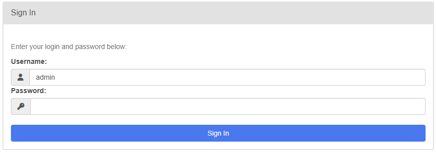

# Отработка навыков работы с Airflow
Проект создает DAG в Apache Airflow, который по расписанию запускает расчёт витрины активности клиентов по сумме и количеству их транзакций.


### Структура проекта

```
.
├── ...
├── data                       # каталог с данными
│   ├── profit_table.csv       # исходная таблица
│   └── flags_activity.csv     # итоговые результаты
├── docs                       # вспомогательный, примеры использования 
├── scripts                    # каталог с данными
│   └── transform_script.py    # код дата-саентистов
├── dag.py                     # DAG файл для Airflow
├── Dockerfile                 # Конфигурация Docker для сборки контейнера
├── requirements.txt           # Зависимости Python
└── README.md                  # файл README
```

## Начало работы
> [!TIP]
> Необходимо для начала проверить, установлена ли последняя версия `Docker`

1. Загрузка и запуск проекта:
> [!NOTE]
> *Для успешного запуска проекта, пожалуйста, проделайте следующие шаги:*
- `$ git clone git@github.com:imkyznetsov/bdasd_final.git` *(создайте клон проекта)*
- `$ docker build --no-cache --progress=plain -t my-airflow:latest .` *(осуществите сборку Docker-образа)*
- `$ docker run -d -p 8080:8080 my-airflow:latest standalone` *(запустите контейнер)*
- Перейдите по адресу: http://localhost:8080 *(в браузере)*
- При появлении диалогового окна введите `логин:пароль`, которые можно найти в логах запущенного `Docker`-контейнера `Login with username:логин password:пароль`


## Выполнил
```
Кузнецов Иван

```